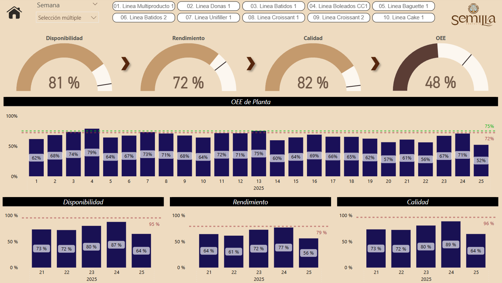

# 📊 Dashboard OEE Panovo - Power BI

Este repositorio contiene un ejemplo real de implementación de un dashboard de Power BI conectado a Sharepoint, orientado al análisis de eficiencia operativa (OEE) en una panificadora.

---

## 📌 Objetivo

Documentar y compartir un modelo de visualización profesional del OEE (Overall Equipment Effectiveness), incluyendo disponibilidad, eficiencia y calidad, junto con sus comparativos históricos y proyecciones.

---

## 🛠️ Tecnologías Utilizadas

- Power BI Desktop (DirectQuery)
- Sharepoint (Consultas a vistas y tablas en producción)
- DAX (Medidas complejas para disponibilidad, eficiencia, forecast, etc.)
- GitHub (para control de versiones y documentación técnica)

---

## 📁 Estructura del Repositorio

```plaintext
OEE_Dashboard/
├── pbix/                                   → Archivo PBIX del tablero
├── README.md                               → Descripción general del repositorio
├── docs/
│   ├── Medidas.md                          → Medidas DAX documentadas
│   ├── Columnas_Calculadas.md              → DAX documentadas
│   ├── Tablas_Catalogo.md                  → DAX documentadas
│   └── video_tutorial.md                   → Guía de uso del dashboard
├── img/
│   ├── preview_dashboard.png               → Captura del dashboard
│   └── modelo_datos.png                    → Relación entre tablas

```

---

## 📷 Preview del Dashboard



---

## 📎 Cómo utilizarlo

1. Clona este repositorio.
2. Abre el archivo `pbix/Dashboard_OEE_Panovo.pbix` con Power BI Desktop.
3. Conecta tu fuente de datos o consulta en Sharepoint.
4. Revisa la documentación en `/docs` para entender cada fórmula y estructura.

---

## 📄 Licencia

MIT – Libre uso con atribución.
